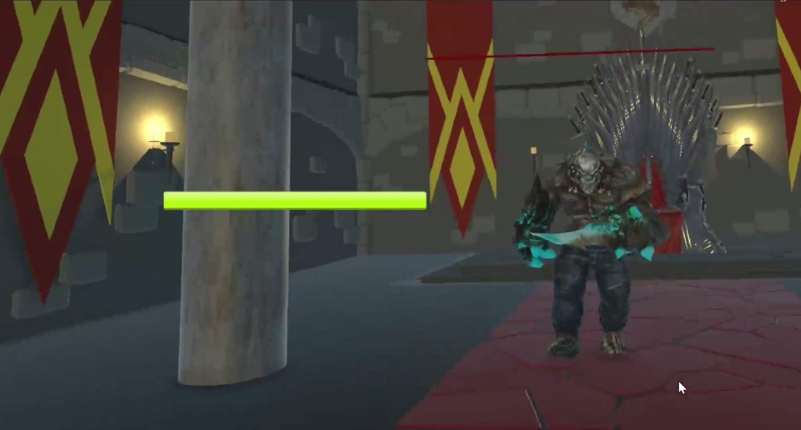

# VR Action Combat Game — Dark Souls Inspired Experience

This project is a **fully completed VR action combat game** inspired by the tense, methodical, and punishing design philosophy of *Dark Souls*. Built from the ground up with a focus on immersive combat and challenge, the game delivers a dark, high-intensity experience designed specifically for virtual reality.

The core goal of the project was to translate the **thrill, difficulty, and satisfaction of Souls-like combat** into a fast-paced VR format while maintaining fairness, responsiveness, and player agency.

---

## Gameplay Overview

Players are placed inside a custom-built castle environment designed to evoke a dark, oppressive atmosphere. Combat emphasizes positioning, timing, and decision-making rather than button mashing. Every encounter is designed to feel dangerous and rewarding.

The game supports **multiple weapon choices**, allowing players to adapt their playstyle and approach combat strategically. Both the player and enemies operate on a fully implemented **health and damage system**, reinforcing risk-reward mechanics throughout the experience.

---

## Combat & Enemy AI

Enemy behavior was **designed and implemented from scratch**, with a strong focus on making enemies feel intelligent, reactive, and threatening rather than scripted.

Enemy AI features include:
- Dynamic dodging and evasion behavior  
- Light and heavy attack patterns  
- Adaptive combat responses based on player actions  
- A power-up state enabling high-damage AOE attacks  
- Aggressive but readable behavior designed for fair VR combat  

Enemies are capable of pressuring the player while still leaving room for counterplay, creating intense encounters that reward patience, timing, and skill.

---

## World & Atmosphere

The game takes place in a **custom-designed castle environment**, built specifically to capture the visual tone and mood of classic Souls-like worlds. Dark lighting, enclosed spaces, and imposing architecture reinforce tension and immersion, making both exploration and combat feel constantly dangerous.

The overall pacing leans toward **fast, engaging combat** while retaining the brutality and weight expected from a Souls-inspired experience.

---

## Project Highlights

- Complete VR game experience  
- Dark Souls–inspired combat design  
- Multiple weapon choices  
- Player and enemy health systems  
- Custom-built castle environment  
- Advanced enemy AI with dodge, evasion, power-ups, and AOE attacks  
- Challenging, dark, and thrilling gameplay loop  

---

## Showcase Video

_Click the image to watch the gameplay video on Google Drive._

---

## Status

This project is **fully completed** and represents a polished VR combat experience focused on difficulty, immersion, and mechanical depth.

